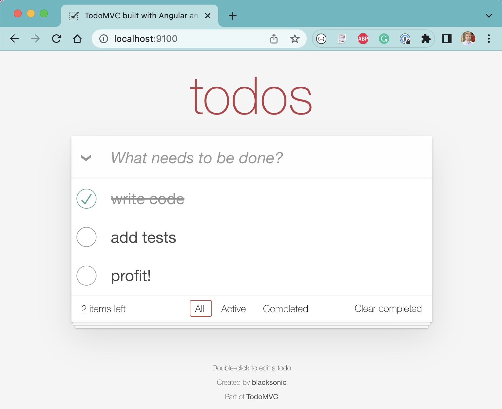
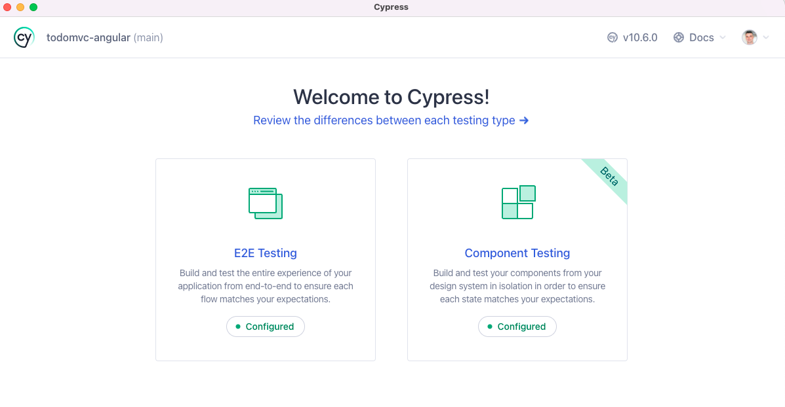

# TodoMVC Testing Using 

## Install

You will need to clone this repository to your local machine and install its dependencies using Node + NPM. To install the dependencies and run these tests, need at least Node v14+.

First, clone this repo to your local machine

```
$ git clone git@github.com:bahmutov/todomvc-angular.git
$ cd todomvc-angular
```

Next install the NPM dependencies

```
$ npm i
```

Check that the application and the API start

```
$ npm run start:all
$ open localhost:9100
```



Check if Cypress v10 opens

```
$ npx cypress open
```

You should see something like this:



## Contents

<!-- prettier-ignore-start -->
Topic | The Markdown | See the slides
---|---|---
Introduction | [intro.md](slides/intro/PITCHME.md) | [link](http://localhost:3100/?p=intro)
Loading and testing the page | [00-start](slides/00-start/PITCHME.md) | [link](http://localhost:3100/?p=00-start)
`cypress open` vs `cypress run` | [01-basic](slides/01-basic/PITCHME.md) | [link](http://localhost:3100/?p=01-basic)
Adding items test, `cypress.json` file | [02-adding-items](slides/02-adding-items/PITCHME.md) | [link](http://localhost:3100/?p=02-adding-items)
Selector Playground and Cypress Studio | [03-selector-playground](slides/03-selector-playground/PITCHME.md) | [link](http://localhost:3100/?p=03-selector-playground)
Reset the database using `cy.request` | [04-reset-state](slides/04-reset-state/PITCHME.md) | [link](http://localhost:3100/?p=04-reset-state)
Control the network requests | [05-xhr](slides/05-xhr/PITCHME.md) | [link](http://localhost:3100/?p=05-xhr)
Angular Component Testing | [06-component-testing](slides/06-component-testing/PITCHME.md) | [link](http://localhost:3100/?p=06-component-testing)
Running tests on CI | [07-ci](slides/07-ci/PITCHME.md) | [link](http://localhost:3100/?p=07-ci)
Retry-ability and flake prevention | [08-retry-ability](slides/08-retry-ability/PITCHME.md) | [link](http://localhost:3100/?p=08-retry-ability)
Custom commands | [09-custom-commands](slides/09-custom-commands/PITCHME.md) | [link](http://localhost:3100/?p=09-custom-commands)
The end | [end](slides/end/PITCHME.md) | [link](http://localhost:3100/?p=end)
<!-- prettier-ignore-end -->

## Small print

This repo was forked from [vuesomedev/todomvc-angular](https://github.com/vuesomedev/todomvc-angular)
