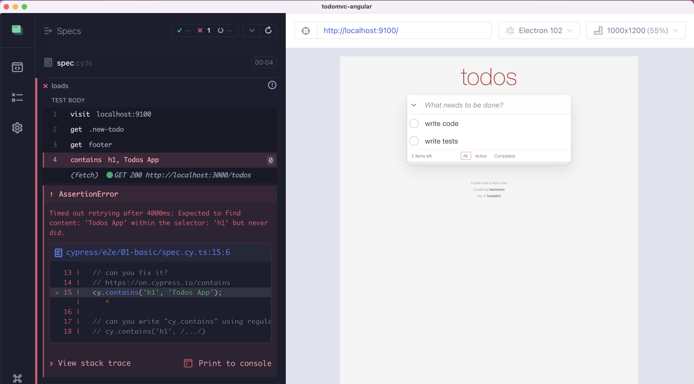

## The very basic tests

### 📚 You will learn

- `cy.contains` and command retries
- two ways to run Cypress
- screenshots and video recording

---

- keep `todomvc` app running
- open Cypress from the root folder with `npm run cy:open`
- click on `e2e/01-basic/spec.cy.ts`

```js
/// <reference types="cypress" />
it('loads', () => {
  cy.visit('localhost:9100');
  cy.get('.new-todo').get('footer');
  cy.contains('h1', 'Todos App');
});
```

+++

`cy.contains('h1', 'Todos App')` is not working 😟



Note:
This is a good moment to show how Cypress stores DOM snapshots and shows them for each step.

+++

## Questions 1/2

- where are the docs for `cy.contains` command?
- why is the command failing? <!-- .element: class="fragment" -->
  - **hint**: use DevTools or look at the page
- can you fix this? <!-- .element: class="fragment" -->

+++

## Questions 2/2

- do you see the command retrying (blue spinner)?
- try using the timeout option to force this one command to try for longer <!-- .element: class="fragment" -->
- change the command timeout for the entire test <!-- .element: class="fragment" -->
- change the command timeout for the project <!-- .element: class="fragment" -->

---

## Cypress has 2 commands

- `cypress open`
- `cypress run`

See [https://on.cypress.io/command-line](https://on.cypress.io/command-line)

+++

## Q: How do you:

- run just the spec `cypress/e2e/01-basic/spec.cy.ts` in headless mode?

Hint: `npx cypress run --help`

+++

## Bonus

**Todo:** use `cypress run` with a failing test.

- video recording [https://on.cypress.io/configuration#Videos](https://on.cypress.io/configuration#Videos)
- `cy.screenshot` command

---

## Fix the test

- can you fix the test?
- how would you select an element: <!-- .element: class="fragment" -->
  - by text
  - by id
  - by class
  - by attributes

**Tip:** https://on.cypress.io/best-practices#Selecting-Elements

---

## 🏁 Conclusions

- most commands retry
- run Cypress in headless mode on CI with `cypress run`
- screenshots and videos

➡️ Pick the [next section](https://github.com/bahmutov/todomvc-angular#contents)
