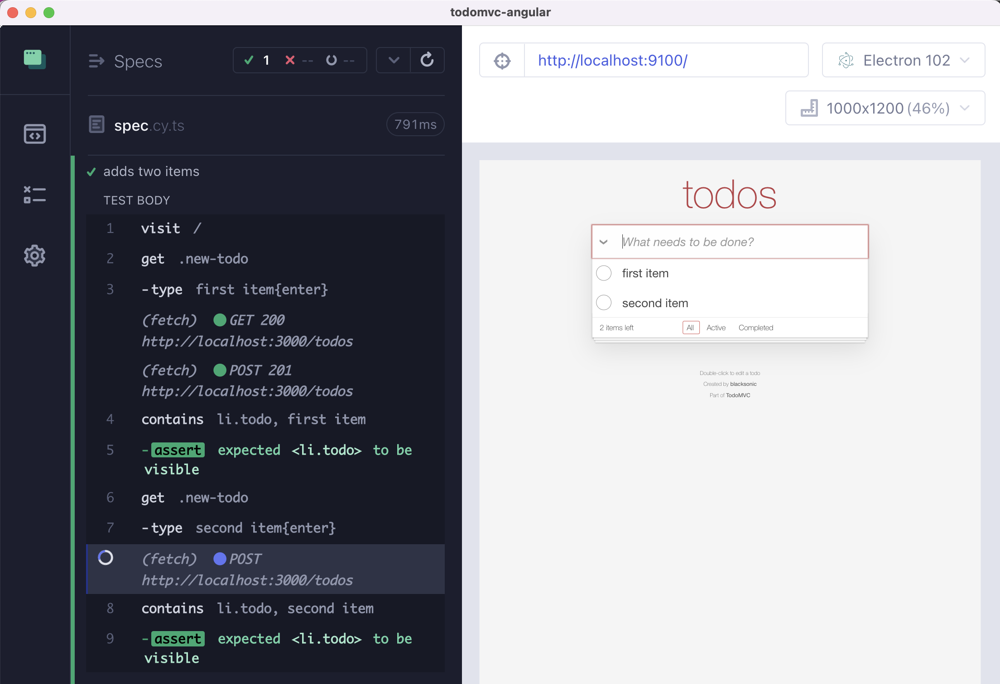
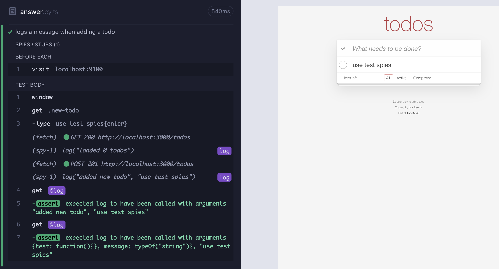
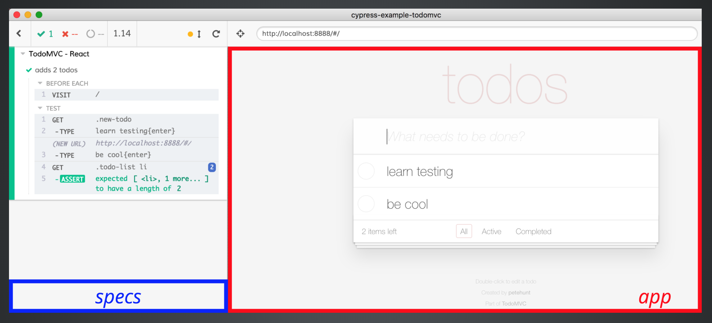

## ☀️ Part 2: Adding items tests

### 📚 You will learn

- the common commands for working with page elements
- organizing the test code using Mocha hooks

---

## What kind of tests?

- discussion: what would you test in the TodoMVC app?

Note:
Longer tests, adding items then deleting one for example. Adding items via GUI and observing communication with the server. Adding items then reloading the page.

---

## Let's test

- keep `todomvc` app running
- open `cypress/e2e/02-adding-items/spec.cy.ts` in your text editor
- click file `02-adding-items/spec.cy.ts` in Cypress

+++

## ⚠️ Warning

The tests we are about to write are NOT resetting the previously added Todo items. Delete the Todo items before each test manually.

We will reset the previously saved Todo items in section "4 Reset State".

---

## Todo: Make this test work

```js
// cypress/e2e/02-adding-items/spec.cy.ts
it.only('adds two items', () => {
  // visit the site
  // https://on.cypress.io/visit
  // repeat twice
  //    get the input field
  //    https://on.cypress.io/get
  //    type text and "enter"
  //    https://on.cypress.io/type
  //    assert that the new Todo item
  //    has been added added to the list
  // cy.get(...).should('have.length', 2)
});
```

**tip** use `cy.get`, `cy.type`, `cy.contains`, `cy.click`, remember `https://on.cypress.io/<command>`

Note:
Draw distinction between commands and assertions, show how commands can be chained, each continues to work with the subject of the previous command. Assertions do not change the subject.

+++

## Adds two items



+++

## Todo: mark the first item completed

```js
it('can mark an item as completed', () => {
  // visit the site
  // adds a few items
  // marks the first item as completed
  // https://on.cypress.io/get
  // https://on.cypress.io/find
  // https://on.cypress.io/first
  // confirms the first item has the expected completed class
  // confirms the other items are still incomplete
  // check the number of remaining items
});
```

+++

## Refactor code 1/3

- create a suite of tests using `describe`
- visit the page before each test

Note:
Avoid duplicate `cy.visit('localhost:3000')` command at the start of each test.

+++

## Refactor code 2/3

- move the base url into `cypress.config.ts`

**tip** look at [https://on.cypress.io/configuration](https://on.cypress.io/configuration)

+++

## Refactor code 3/3

- make a helper function to add todo item

**tip** it is just JavaScript

Note:
Move `addItem` function into a separate file and import from the spec file. It is just JavaScript, and Cypress bundles each spec file, so utilities can have `cy...` commands too!

---

## Todo: delete an item

```javascript
it('can delete an item', () => {
  // adds a few items
  // deletes the first item
  // use force: true because we don't want to hover
  // confirm the deleted item is gone from the dom
  // confirm the other item still exists
});
```

+++

## Implement hover 🕴

Install [cypress-real-events](https://github.com/dmtrKovalenko/cypress-real-events) and use `cy.realHover` command in the "can delete an item" test.

```js
cy.contains('li.todo', 'second item')
  .should('be.visible')
  .realHover()
  .find('.destroy')
  // use the cy.wait command to make it clear what is going on
  .wait(1000)
  .click();
```

---

## Todo: use random text

```javascript
it('adds item with random text', () => {
  // use a helper function with Math.random()
  // or Cypress._.random() to generate unique text label
  // add such item
  // and make sure it is visible and does not have class "completed"
});
```

---

## Todo: no items

```js
it('starts with zero items', () => {
  // check if the list is empty initially
  //   find the selector for the individual TODO items in the list
  //   use cy.get(...) and it should have length of 0
  //   https://on.cypress.io/get
  //   ".should('have.length', 0)"
  //   or ".should('not.exist')"
});
```

---

## Default assertions

```js
cy.get('li.todo');
// is the same as
cy.get('li.todo').should('exist');
```

See [cy.get Assertions](https://on.cypress.io/get#Assertions)

+++

What if you do not know if an element exists? You can disable the built-in assertions using a "dummy" `should(cb)` assertion.

```js
cy.get('li.todo').should(() => {});
// or using the bundled Lodash
cy.get('li.todo').should(Cypress._.noop);
```

Todo: write test "disables the built-in assertion".

---

## Todo: delete all items at the start

Todo: write the test "deletes all items at the start"

There might be two implementations (cy.each vs click on multiple elements)

---

## Todo: number of items increments by one

How do you check if an unknown number of items grows by one? There might be no items at first.

Implement the test "adds one more todo item"

---

## 💡 Pro tips

- resize the viewport in `cypress.config.ts`
- resize the viewport per test

---

## Todo: Check the items are preserved

Implement the test "confirms the items were saved by reloading the page"

---

## Todo: Check the items on the server

🙋🏻‍♂️ How does the application load its todos? Can the test use the same method to checked the saved items? **Hint:** use the [cy.request](https://on.cypress.io/request)

Implement the test "confirms the items were saved by requesting them"

---

## Todo: Checking the saved items

The application saves the items in "data.json" file. Can we verify that a new item has been saved?

Todo: write the test "saves the added todos"

**Tip:** use [cy.task](https://on.cypress.io/task) in the plugins file or [cy.readFile](https://on.cypress.io/readfile)

---

## Bonus

Unit tests vs end-to-end tests

### Unit tests

```javascript
import add from './add';
test('add', () => {
  expect(add(2, 3)).toBe(5);
});
```

- arrange - action - assertion

+++

### End-to-end tests

```javascript
const addItem = text => {
  cy.get('.new-todo').type(`${text}{enter}`);
};
it('can mark items as completed', () => {
  const ITEM_SELECTOR = 'li.todo';
  addItem('simple');
  addItem('difficult');
  cy.contains(ITEM_SELECTOR, 'simple')
    .should('exist')
    .find('input[type="checkbox"]')
    .check();
  // have to force click because the button does not appear unless we hover
  cy.contains(ITEM_SELECTOR, 'simple')
    .find('.destroy')
    .click({ force: true });
  cy.contains(ITEM_SELECTOR, 'simple').should('not.exist');
  cy.get(ITEM_SELECTOR).should('have.length', 1);
  cy.contains(ITEM_SELECTOR, 'difficult').should(
    'be.visible'
  );
});
```

command - assertion - command - assertion (CACA pattern)

- **tip** check out `cy.pause` command

Note:
Revisit the discussion about what kind of tests one should write. E2E tests can cover a lot of features in a single test, and that is a recommended practice. If a test fails, it is easy to debug it, and see how the application looks during each step.

+++

### Unit vs E2E

- if you are describing how code works: unit test
- if you are describing how code is used by the user: end-to-end test

+++

## Todo: run unit tests in Cypress

Does this test run in Cypress?

```javascript
import add from './add';
test('add', () => {
  expect(add(2, 3)).toBe(5);
});
```

+++

### Bonus

- Core concepts [https://on.cypress.io/writing-and-organizing-tests](https://on.cypress.io/writing-and-organizing-tests)

---

Organize tests using folder structure and spec files

```text
cypress/e2e/
  featureA/
    first-spec.cy.js
    second-spec.cy.js
  featureB/
    another-spec.cy.js
    errors-spec.cy.js
```

**Tip:** splitting longer specs into smaller ones allows to run them faster in parallel mode [glebbahmutov.com/blog/split-spec/](https://glebbahmutov.com/blog/split-spec/)

+++

Organize tests inside a spec using Mocha functions

```js
describe('Feature A', () => {
  beforeEach(() => {});

  it('works', () => {});

  it('handles error', () => {});

  // context is alias of describe
  context('in special case', () => {
    it('starts correctly', () => {});

    it('works', () => {});
  });
});
```

---

## The support file(s)

Support file is included before each spec file. **Note** actual files are loaded using XHRs

```html
<script src="cypress/support/e2e.ts"></script>
<script src="cypress/e2e/spec.cy.ts"></script>
```

💡: Want to reset the data and visit the site before each test? Put the commands into "beforeEach" hook inside the support file. <!-- .element: class="fragment" -->

💡💡: There are separate support files for E2E and component tests. <!-- .element: class="fragment" -->

---

## 🕵🏻 Spy on the browser API

When application adds a todo, it prints a message using `console.log`. Can you spy on the `console.log` method to confirm it?

⌨️ implement the test "logs a message when adding a todo"

+++



+++

```js
it('logs a message when adding a todo', () => {
  cy.window().then(win => {
    cy.spy(win.console, 'log').as('log');
  });
  cy.get('.new-todo').type('use test spies{enter}');
  cy.get('@log').should(
    'have.been.calledWith',
    'added new todo',
    'use test spies'
  );
});
```

---

Why `cy.window()`?



---

## 🏁 Write your tests like a user

- go through UI
- validate the application after actions

➡️ Pick the [next section](https://github.com/bahmutov/todomvc-angular#contents)
