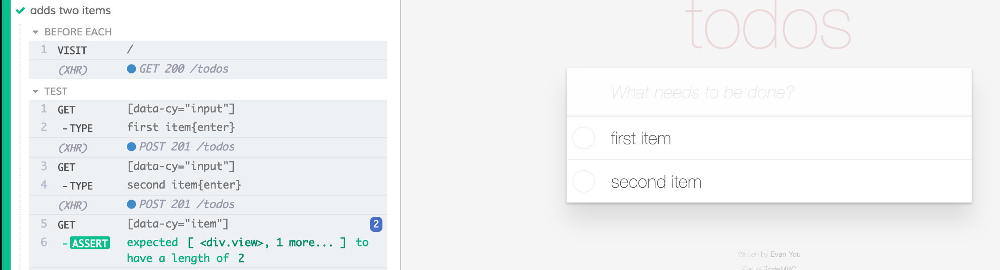

## ☀️ Part 3: Selector playground

### 📚 You will learn

- Cypress Selector Playground tool
- best practices for selecting elements
- ~~Cypress Studio~~ for recording tests
- Cypress Chrome recorder

+++

- keep `todomvc` app running
- open `03-selector-playground/spec.cy.ts`

---

> How do we select element in `cy.get(...)`?

- Browser's DevTools can suggest selector

+++


+++

Open "Selector Playground"


+++

Selector playground can suggest much better selectors.


+++

⚠️ It can suggest a weird selector


+++

Read [best-practices.html#Selecting-Elements](https://docs.cypress.io/guides/references/best-practices.html#Selecting-Elements)


+++

## Todo

- add test data ids to the component HTML template markup
- use new selectors to write `cypress/e2e/03-selector-playground/spec.cy.ts`

```js
// fill the selector, maybe use "tid" function
cy.get('...').should('have.length', 2);
```

Note:
The updated test should look something like the next image (`data-cy`, `data-test`, etc)

+++



+++

## 💡 Cypress is just JavaScript

```js
import { selectors, tid } from './common-selectors';
it('finds element', () => {
  cy.get(selectors.todoInput).type('something{enter}');

  // "tid" forms "data-test-id" attribute selector
  // like "[data-test-id='item']"
  cy.get(tid('item')).should('have.length', 1);
});
```

---

## 🎥 Cypress Studio

Record tests by clicking on the page, was removed in [Cypress v10](https://on.cypress.io/changelog#10-0-0) 😭.


---

## Chrome Cypress Recorder

- Install [Cypress Chrome recorder extension](https://chrome.google.com/webstore/detail/cypress-chrome-recorder/fellcphjglholofndfmmjmheedhomgin)


+++


+++


+++


+++

## Todo: record a Cypress test

Is the recorded test 100% done? What is it missing?

---

## 🏁 Selecting Elements

- Use Selector Playground
- follow [https://on.cypress.io/best-practices#Selecting-Elements](https://on.cypress.io/best-practices#Selecting-Elements)
- **bonus:** try [@testing-library/cypress](https://testing-library.com/docs/cypress-testing-library/intro)

+++

## 🏁 Quickly write tests

- use Chrome Recorder with Cypress test export extension

➡️ Pick the [next section](https://github.com/bahmutov/todomvc-angular#contents)
