## ☀️ Part 6: Component Testing

### 📚 You will learn

- how to write an Angular Component Test
- how to spy on or stub an application method

+++

## Cypress v10.5.0

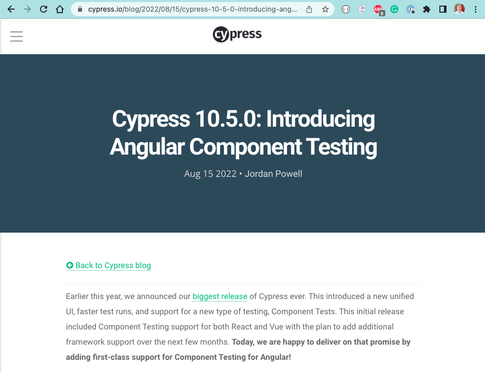

[https://www.cypress.io/blog/2022/08/15/cypress-10-5-0-introducing-angular-component-testing/](https://www.cypress.io/blog/2022/08/15/cypress-10-5-0-introducing-angular-component-testing/)

+++

## Testing Types

- End-to-End testing
- API testing using "cy.request" calls <!-- .element: class="fragment" -->
- Unit testing <!-- .element: class="fragment" -->
- Component testing <!-- .element: class="fragment" -->

+++

## Testing type comparison

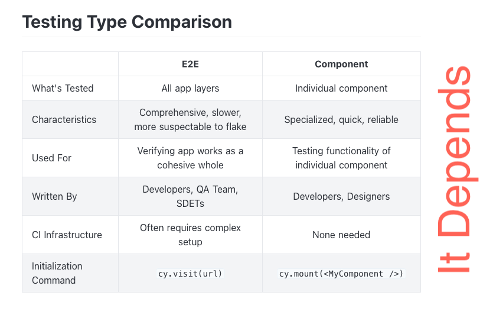

[https://on.cypress.io/testing-types](https://on.cypress.io/testing-types)

---

- close the `todomvc` app 🤯
- `npx cypress open`

Component tests live close to their components in the "src" folder

+++

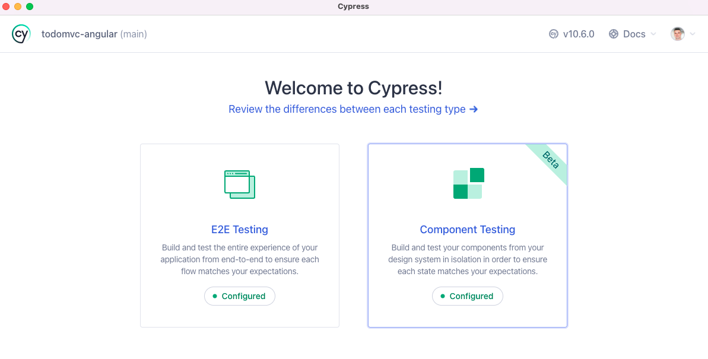

+++

## 💡 Quickly switch the testing type

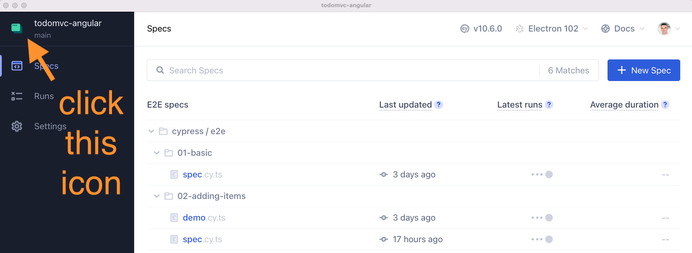

---

## Angular component testing doc

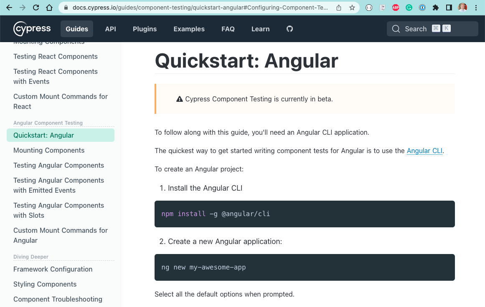

[https://docs.cypress.io/guides/component-testing/quickstart-angular](https://docs.cypress.io/guides/component-testing/quickstart-angular)

---

## The first Item component test

Spec file `src/app/components/item/item.cy.ts`

⌨️ Implement the test "mounts the component"

```js
import { ItemComponent } from './item.component';
// https://on.cypress.io/component-testing/mounting-angular
it('mounts the component', () => {
  const todo = {
    id: '101',
    title: 'Write code',
    completed: false
  };
  // use cy.mount command from
  // cypress/support/component.ts
  // to mount the ItemComponent
  // with options componentProperties { todo }
  // confirm the page contains ".todo"
  // with text todo.title
  // and it is incomplete
});
```

+++

## Mount the template

```js
it('mounts the template', () => {
  const todo = {
    id: '101',
    title: 'Write code here',
    completed: false
  };
  // use cy.mount to mount an HTML template
  // cy.mount('<app-item [todo]="todo"></app-item>'
  // and pass the ItemComponent declaration
  // plus component properties with todo
  //
  // confirm the page contains ".todo"
  // with text todo.title
  // and it is incomplete
});
```

+++

## Mount a template to match app CSS

How does the app apply its CSS? Can you make the template HTML in the test "shows an item with style" match it?

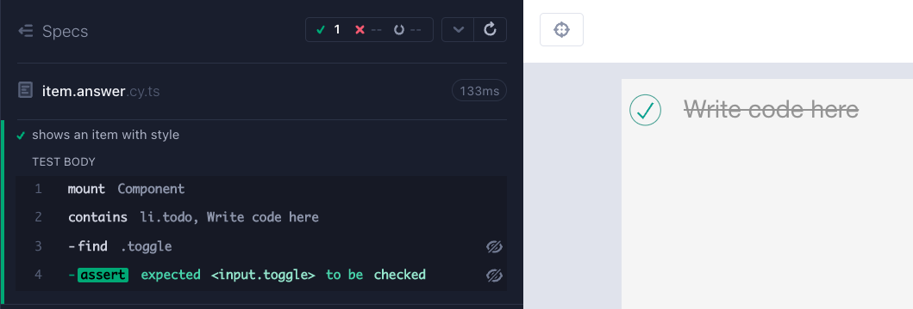

Note:
Show the devtools and how "src/styles.css" is fetched - because it comes via angular.json file automatically read by the Cypress dev server.

+++

```js
it('shows an item with style', () => {
  const todo = {
    id: '101',
    title: 'Write code here',
    completed: true
  };
  cy.mount(
    `
      <ul class="todo-list">
        <app-item [todo]="todo"></app-item>
      </ul>
    `,
    {
      declarations: [ItemComponent],
      componentProperties: {
        todo
      }
    }
  );
  cy.contains('li.todo', 'Write code here')
    .should('have.class', 'completed')
    .find('.toggle')
    .should('be.checked');
});
```

---

## Component calls handleUpdate

The list component mounts the item component like this

```html
<app-item
  *ngFor="let todo of (visibleTodos$ | async)"
  [todo]="todo"
  (remove)="handleRemove($event)"
  (update)="handleUpdate($event)"
></app-item>
```

It passes the `update` property

+++

⌨️ write the test "calls the update to complete the item"

Use [cy.stub](https://on.cypress.io/stub) and [cy.as](https://on.cypress.io/as)

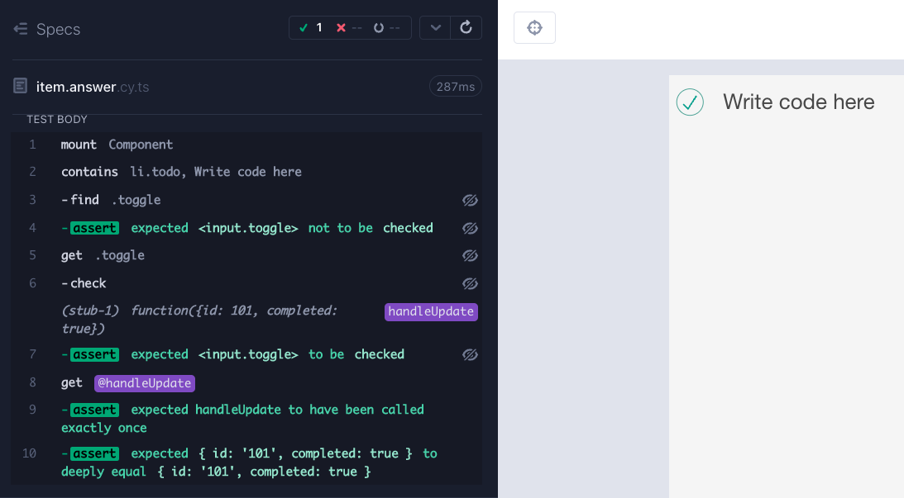

+++

```js
it('calls the update to complete the item', () => {
  const todo = {
    id: '101',
    title: 'Write code here',
    completed: false
  };
  cy.mount(
    `
      <ul class="todo-list">
        <app-item [todo]="todo" (update)="handleUpdate($event)"></app-item>
      </ul>
    `,
    {
      declarations: [ItemComponent],
      componentProperties: {
        todo,
        handleUpdate: cy.stub().as('handleUpdate')
      }
    }
  );
  // confirm the Todo is present and check the toggle
  cy.contains('li.todo', 'Write code here')
    .find('.toggle')
    .should('not.be.checked');
  cy.get('.toggle').check().should('be.checked');
  cy.get('@handleUpdate')
    .should('have.been.calledOnce')
    .its('firstCall.args.0', { timeout: 0 })
    .should('deep.equal', {
      id: '101',
      completed: true
    });
});
```

+++

Why isn't the Todo item look "completed"?

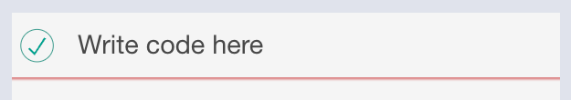

It is missing the class `completed` that gives the strike through decoration

+++

⌨️ Implement the test "updates the component when the data changes"

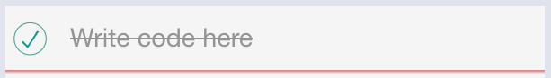

Note:
The component simply reflects the data passed. We need to update the `todo` component we pass as a prop.

+++

```js
it('updates the component when the data changes', () => {
  const todo = {
    id: '101',
    title: 'Write code here',
    completed: false
  };
  cy.mount(
    `
      <ul class="todo-list">
        <app-item [todo]="todo" (update)="handleUpdate($event)"></app-item>
      </ul>
    `,
    {
      declarations: [ItemComponent],
      componentProperties: {
        todo,
        handleUpdate: cy
          .stub()
          .as('handleUpdate')
          .callsFake(
            ({ completed }) => (todo.completed = completed)
          )
      }
    }
  );
  cy.contains('li.todo', 'Write code here')
    .find('.toggle')
    .should('not.be.checked');
  cy.get('.toggle').check().should('be.checked');
  cy.get('.todo').should('have.class', 'completed');
  cy.get('@handleUpdate').should('have.been.calledOnce');
});
```

---

## Compare to Angular test harness

Look at the tests in "item.component.spec.ts". Can you implement the test "should notify about remove button"?

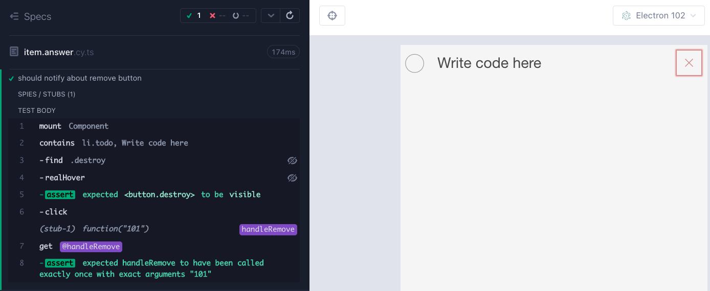

+++

```js
import 'cypress-real-events/support';
it('should notify about remove button', () => {
  const todo = {
    id: '101',
    title: 'Write code here',
    completed: false
  };
  cy.mount(
    `
      <ul class="todo-list">
        <app-item [todo]="todo" (remove)="handleRemove($event)"></app-item>
      </ul>
    `,
    {
      declarations: [ItemComponent],
      componentProperties: {
        todo,
        handleRemove: cy.stub().as('handleRemove')
      }
    }
  );
  cy.contains('li.todo', 'Write code here')
    .find('.destroy')
    .realHover()
    .should('be.visible')
    .click();
  cy.get('@handleRemove').should(
    'be.calledOnceWithExactly',
    todo.id
  );
});
```

---

## Angular testing utilities included

⌨️ test "yields the component and the Angular TestBed utils"

```js
cy.mount(
  `
    <ul class="todo-list">
      <app-item [todo]="todo"></app-item>
    </ul>
  `,
  {
    declarations: [ItemComponent],
    componentProperties: {
      todo
    }
  }
).then(console.log);
```

+++

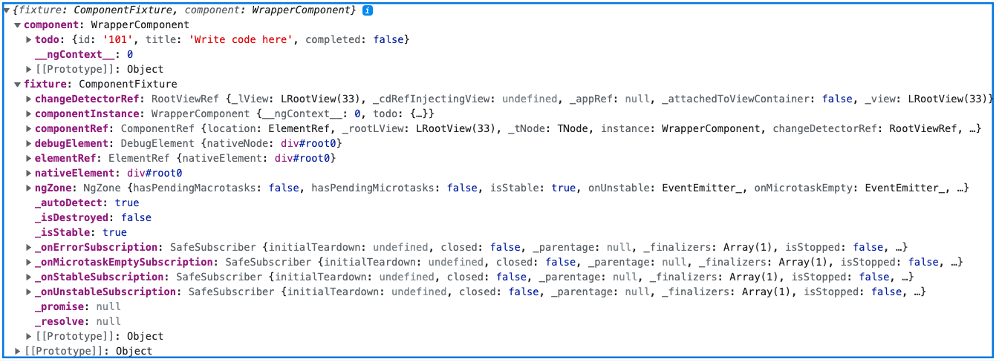

+++

## With great power...

⌨️ extend the test "yields the component and the Angular TestBed utils"

```js
.then(console.log)
.then(({ component }) => {
  component.todo.completed = true;
});
cy.get('.todo').should('have.class', 'completed');
```

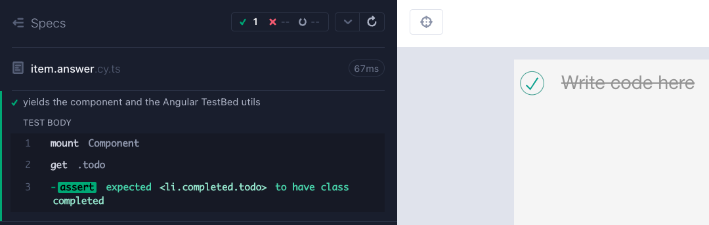

---

## Test the list component

⌨️ finish the test "shows the items" in the spec `list.cy.ts`

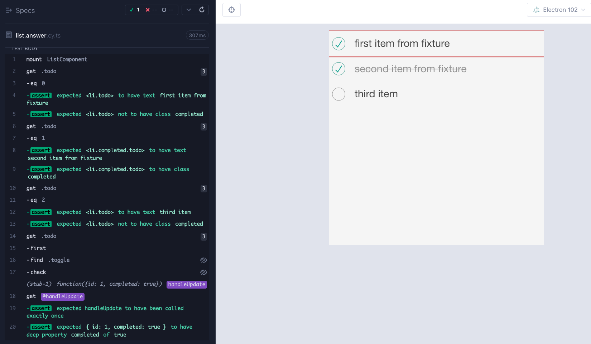

+++

```js
import threeItems from '../../../../cypress/fixtures/three-items.json';
it('shows the items', () => {
  const store = createStore({
    todos: threeItems,
    filter: FILTERS.all
  });
  cy.mount(ListComponent, {
    declarations: [ItemComponent],
    imports: [StoreModule.forRoot(store)],
    componentProperties: {
      handleUpdate: cy.stub().as('handleUpdate')
    }
  });
  threeItems.forEach((item, k) => {
    cy.get('.todo')
      .eq(k)
      .should('have.text', item.title)
      .and(
        item.completed ? 'have.class' : 'not.have.class',
        'completed'
      );
  });
  cy.get('.todo').first().find('.toggle').check();
  cy.get('@handleUpdate')
    .should('have.been.calledOnce')
    .its('firstCall.args.0', { timeout: 0 })
    .should('deep.include', {
      id: threeItems[0].id,
      completed: true
    });
});
```

---

## If the component makes network calls ☎️

⌨️ finish the test "shows the items" in `app.cy.ts` spec file

+++

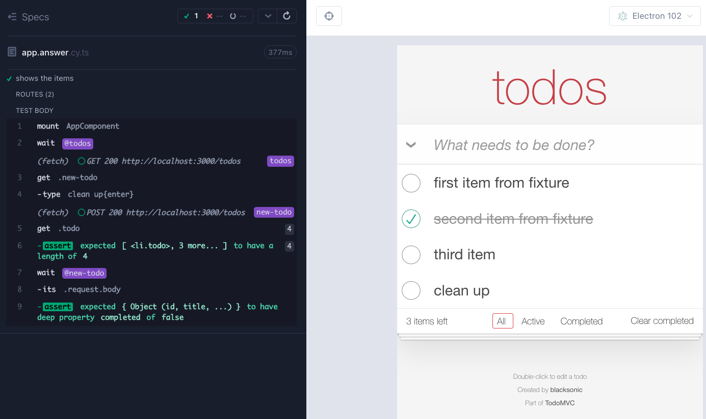

+++

```js
it('shows the items', { viewportHeight: 700 }, () => {
  const store = createStore({
    todos: [],
    filter: FILTERS.all
  });

  cy.intercept('GET', '/todos', {
    fixture: 'three-items.json'
  }).as('todos');

  cy.mount(AppComponent, {
    declarations: [
      HeaderComponent,
      ListComponent,
      ItemComponent,
      CopyRightComponent,
      FooterComponent
    ],
    imports: [StoreModule.forRoot(store)]
  });
  cy.wait('@todos');
  cy.intercept('POST', '/todos', {}).as('new-todo');
  cy.get('.new-todo').type('clean up{enter}');
  cy.get('.todo').should('have.length', 4);
  cy.wait('@new-todo')
    .its('request.body')
    .should('deep.include', {
      title: 'clean up',
      completed: false
    });
});
```

+++

## Control the ~~destiny~~ randomness

```js
cy.wait('@new-todo')
  .its('request.body')
  .should('deep.include', {
    title: 'clean up',
    completed: false
  });
```

Why don't we know the `id` property?

+++

## Stub Math.random

Application gets its item id like this:

```js
function randomId() {
  return Math.random().toString().substr(2, 10);
}
```

We can control the `Math.random` method from the test "controls the new item ID"

```js
cy.stub(window.Math, 'random').returns(0.123);
// Tip: in an end-to-end test we need to use cy.window first
cy.window().then(win => {
  cy.stub(win.Math, 'random').returns(0.123);
});
```

+++

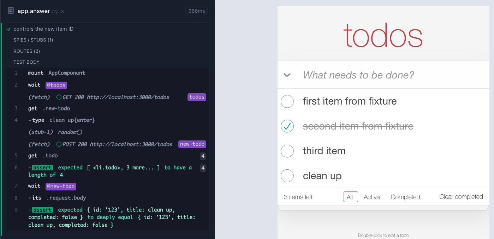

---

## 🏁 Component tests are like mini-web apps

- `cy.mount(component, props)`
- use any Cypress commands (except `cy.visit`)
- confirm the component works

+++

[cypress-io/cypress-component-testing-apps](https://github.com/cypress-io/cypress-component-testing-apps) including standalone Angular component examples.

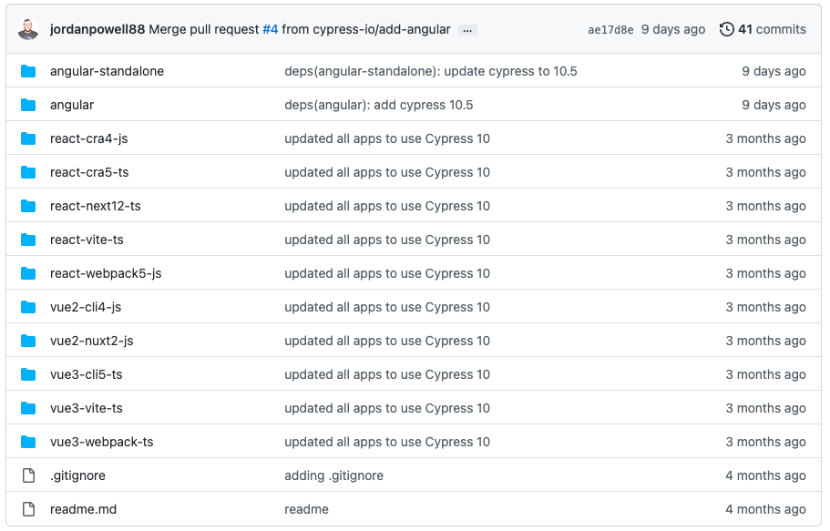

➡️ Pick the [next section](https://github.com/bahmutov/todomvc-angular#contents)
