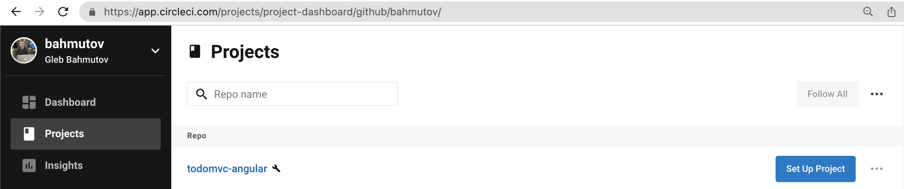
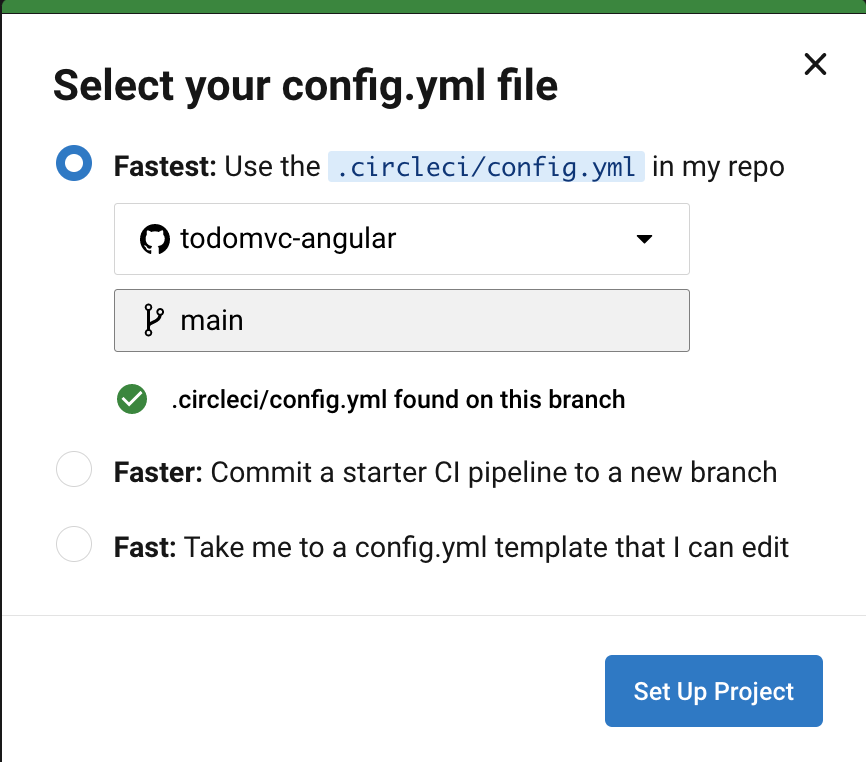
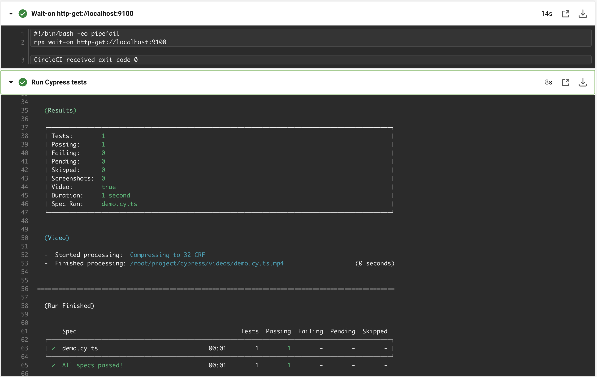
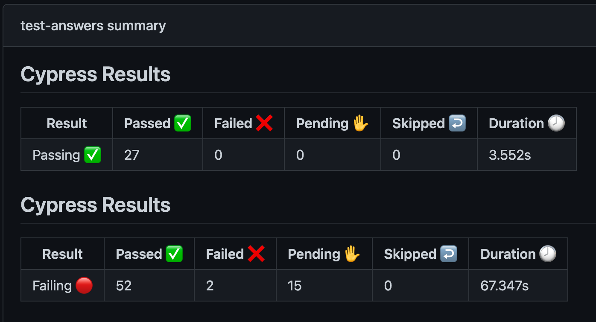
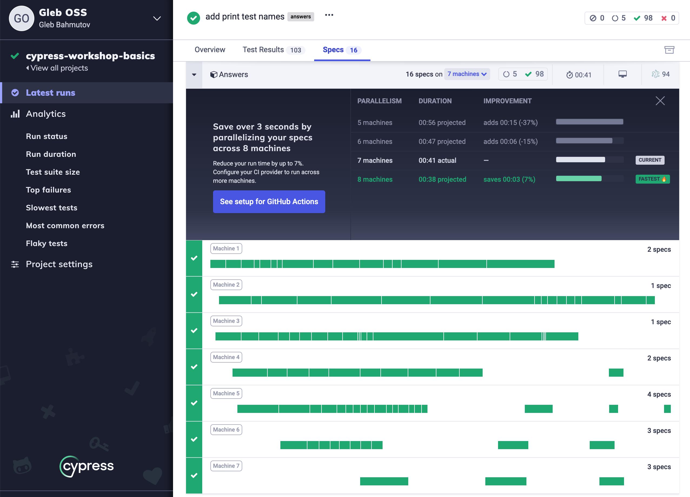

## ☀️ Part 7: Continuous integration

### 📚 You will learn

- Cypress Docker images for dependencies
- Installing and caching Cypress itself
- How to start server and run Cypress tests
- CircleCI Orb example
- GitHub Actions example
- GitHub reusable workflows
- How to run your tests faster 🏎

---

## Poll: what CI do you use?

- ❤️ GitHub Actions
- 👏 CircleCI <!-- .element: class="fragment" -->
- 👍 Jenkins <!-- .element: class="fragment" -->
- 🎉 Something else <!-- .element: class="fragment" -->

---

## Todo if possible

- sign up for free account on CircleCI
- use your fork of https://github.com/bahmutov/todomvc-angular

Or make your copy of it using

```
$ npx degit https://github.com/bahmutov/todomvc-angular my-example
$ cd my-example
$ npm i
$ npm run start:all
# create GitHub repo and push "my-example"
```

---

## Open vs Run

- work in the interactive mode with `cypress open`
- run the e2e specs in the headless mode with `cypress run`
- run the component specs in the headless mode with `cypress run --component`

See [https://on.cypress.io/command-line](https://on.cypress.io/command-line)

---

## Continuous integration documentation

- [https://on.cypress.io/continuous-integration](https://on.cypress.io/continuous-integration)
- [https://on.cypress.io/ci](https://on.cypress.io/ci) (alias)

+++

## On every CI:

- install and cache dependencies
- start the app and any services in the background
- run Cypress using `npx cypress run`
- (maybe) stop the background apps

---

## CircleCI

1. manual step by step configuration 😓
2. using Cypress CircleCI Orb 😌

See [https://github.com/cypress-io/circleci-orb](https://github.com/cypress-io/circleci-orb)

+++

## Set up CircleCI

- sign up for CircleCI
- add your project to CircleCI



+++

## Use the .circleci/config.yml



---

## CircleCI step-by-step config 📝

+++

```yaml
version: 2
jobs:
  build:
    docker:
      - image: cypress/base:16.14.2
    working_directory: ~/repo
    steps:
      - checkout
      - restore_cache:
          keys:
            - dependencies-{{ checksum "package-lock.json" }}
      - run:
          name: Install dependencies
          # https://docs.npmjs.com/cli/ci
          command: npm ci
      - run:
          name: Check Cypress
          command: npx cypress verify
      - save_cache:
          paths:
            - ~/.npm
            - ~/.cache
          key: dependencies-{{ checksum "package-lock.json" }}
      # continued: start the app and run the tests
```

+++

```yaml
- run:
    name: Run Cypress component tests
    command: npx cypress run --component
# two commands: start server, run tests
- run:
    name: Start API
    command: npm run api:start
    background: true
- run:
    name: Start web application
    command: npm start
    background: true
- run:
    name: Run Cypress E2E tests
    command: npx cypress run
```

+++

Alternative: use [start-server-and-test](https://github.com/bahmutov/start-server-and-test)

```yaml
- run:
  name: Start and test
  # starts the services
  command: npm test
```

```json
{
  "scripts": {
    "api:start": "...",
    "start": "ng serve",
    "start:all": "run-p start api:start",
    "cy:run": "cypress run",
    "dev": "start-test start:all 9100 e2e",
    "test": "start-test start:all 9100 cy:run"
  }
}
```

---

## CircleCI Cypress Orb

A _much simpler_ CI configuration.

```yaml
version: 2.1
orbs:
  # import Cypress orb by specifying an exact version x.y.z
  # or the latest version 2.x.x using "@2" syntax
  # https://github.com/cypress-io/circleci-orb
  cypress: cypress-io/cypress@2
workflows:
  build:
    jobs:
      # "cypress" is the name of the imported orb
      # "run" is the name of the job defined in Cypress orb
      # runs all E2E tests by default
      - cypress/run:
          # we can use Docker or an executor specified in the orb
          executor: cypress/base-16-14-2-slim
          # instead of building the app, run the component tests
          build: npx cypress run --component
          start: npm run start:all
          wait-on: 'http-get://localhost:9100'
```

See [https://github.com/cypress-io/circleci-orb](https://github.com/cypress-io/circleci-orb)

+++

## Run E2E and component tests 🧪

```yml
- cypress/run:
    component: true
# or use the build step instead
- cypress/run:
    build: npx cypress run --component
```

+++



---

## Store the test artifacts

```yaml
version: 2.1
orbs:
  # https://github.com/cypress-io/circleci-orb
  cypress: cypress-io/cypress@2
workflows:
  build:
    jobs:
      - cypress/run:
          # store videos and any screenshots after tests
          store_artifacts: true
```

+++

## Record results on Dashboard

```yaml
version: 2.1
orbs:
  # https://github.com/cypress-io/circleci-orb
  cypress: cypress-io/cypress@2
workflows:
  build:
    jobs:
      # set CYPRESS_RECORD_KEY as CircleCI
      # environment variable
      - cypress/run:
          record: true
```

[https://on.cypress.io/dashboard-introduction](https://on.cypress.io/dashboard-introduction)

+++

## Parallel builds

```yaml
version: 2.1
orbs:
  # https://github.com/cypress-io/circleci-orb
  cypress: cypress-io/cypress@2
workflows:
  build:
    jobs:
      - cypress/install # single install job
      - cypress/run: # 4 test jobs
          requires:
            - cypress/install
          record: true # record results on Cypress Dashboard
          parallel: true # split all specs across machines
          parallelism: 4 # use 4 CircleCI machines
```

+++

## CircleCI Cypress Orb

Never struggle with CI config 👍

- [github.com/cypress-io/circleci-orb](https://github.com/cypress-io/circleci-orb)
- [circleci.com/orbs/registry/orb/cypress-io/cypress](https://circleci.com/orbs/registry/orb/cypress-io/cypress)
- 📺 [CircleCI + Cypress webinar](https://youtu.be/J-xbNtKgXfY)

---

## GitHub Actions

- cross-platform CI built on top of Azure CI + MacStadium
- Linux, Windows, and Mac
- Official [cypress-io/github-action](https://github.com/cypress-io/github-action)
- v4 supports Component testing

+++

```yaml
jobs:
  cypress-run:
    runs-on: ubuntu-20.04
    steps:
      - uses: actions/checkout@v3
      # https://github.com/cypress-io/github-action
      - uses: cypress-io/github-action@v4
        with:
          start: 'npm run start:all'
          wait-on: 'http://localhost:9100'
```

Check the [.github/workflows/ci.yml](https://github.com/bahmutov/todomvc-angular/blob/main/.github/workflows/ci.yml) file

+++

## Run component tests + E2E 🧪

```yaml
name: ci
on: push
jobs:
  test-answers:
    runs-on: ubuntu-20.04
    steps:
      - name: Checkout 🛎
        uses: actions/checkout@v3

      # https://github.com/cypress-io/github-action
      - name: Test component tests 🧩
        uses: cypress-io/github-action@v4
        with:
          component: true

      # https://github.com/cypress-io/github-action
      - name: Test E2E answers 🤔
        uses: cypress-io/github-action@v4
        with:
          # Cypress dependencies were installed in the previous test step
          install: false
          start: 'npm run start:all'
          wait-on: 'http://localhost:9100'
```

+++

## GitHub Actions run



+++

## Store test artifacts

Add after the test run

```yml
- uses: actions/upload-artifact@v3
  if: failure()
  with:
    name: cypress-screenshots
    path: cypress/screenshots
# Test run video was always captured, so this action uses "always()" condition
- uses: actions/upload-artifact@v3
  if: always()
  with:
    name: cypress-videos
    path: cypress/videos
```

---

## GitHub Reusable Workflows

```yml
name: ci
on: [push]
jobs:
  test:
    # use the reusable workflow to check out the code, install dependencies
    # and run the Cypress tests
    # https://github.com/bahmutov/cypress-workflows
    uses: bahmutov/cypress-workflows/.github/workflows/standard.yml@v1
    with:
      start: npm start
```

[https://github.com/bahmutov/cypress-workflows](https://github.com/bahmutov/cypress-workflows)

---

## Cypress on CI: take away

- use `npm ci` command instead of `npm install`
- cache `~/.npm` and `~/.cache` folders
- use [start-server-and-test](https://github.com/bahmutov/start-server-and-test) for simplicity
- store videos and screenshots yourself or use Cypress Dashboard

---

## Run E2E faster

1. Run changed specs first
2. Run tests by tag
3. Run tests in parallel

+++

1. Run changed specs first

Read [Get Faster Feedback From Your Cypress Tests Running On CircleCI](https://glebbahmutov.com/blog/faster-ci-feedback-on-circleci/)

```
$ specs=$(npx find-cypress-specs --branch main)
$ npx cypress run --spec $specs
```

See [find-cypress-specs](https://github.com/bahmutov/find-cypress-specs)

+++

2. Run tests by tag

Read [How To Tag And Run End-to-End Tests](https://glebbahmutov.com/blog/tag-tests/)

```js
it('logs in', { tags: 'user' }, () => ...)
```

```
$ npx cypress run --env grepTags=user
```

See [cypress-grep](https://github.com/cypress-io/cypress-grep)

+++

3. Run tests in parallel



+++

## Examples of running specs in parallel

- [Make Cypress Run Faster by Splitting Specs](https://glebbahmutov.com/blog/split-spec/)
- [Split Long GitHub Action Workflow Into Parallel Cypress Jobs](https://glebbahmutov.com/blog/parallel-cypress-tests-gh-action/)
- [Testing Time Zones in Parallel](https://glebbahmutov.com/blog/testing-timezones/)

---

## Todo

Find the CI you use on [https://on.cypress.io/continuous-integration](https://on.cypress.io/continuous-integration) and [https://github.com/cypress-io/cypress-example-kitchensink#ci-status](https://github.com/cypress-io/cypress-example-kitchensink#ci-status)

---

## 🏁 Cypress on CI

- presentation [CircleCI Orbs vs GitHub Actions vs Netlify Build Plugins CI Setup](https://slides.com/bahmutov/ci-triple)
- my [GitHub Actions blog posts](https://glebbahmutov.com/blog/tags/github/)
- my [CircleCI blog posts](https://glebbahmutov.com/blog/tags/circle/)

➡️ Pick the [next section](https://github.com/bahmutov/cypress-workshop-basics#contents)
