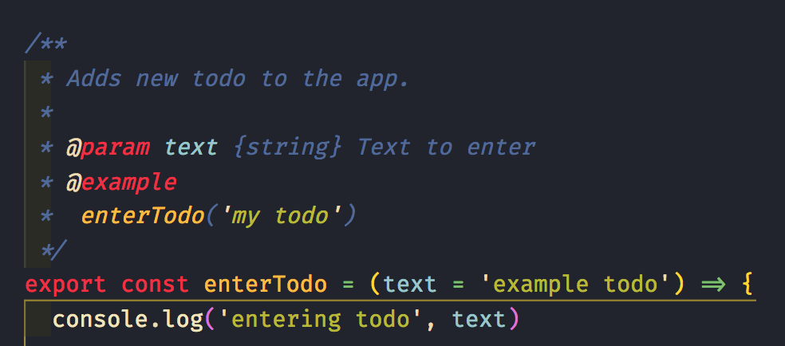
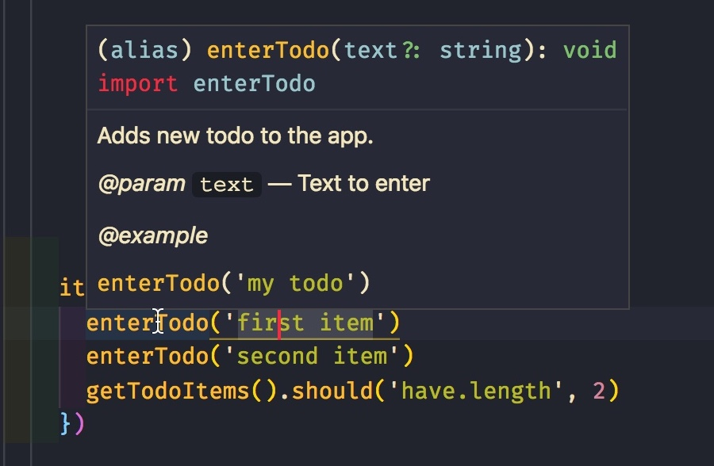
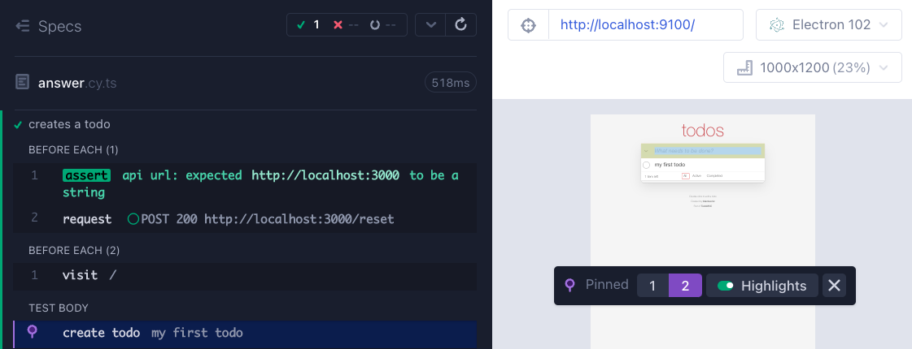
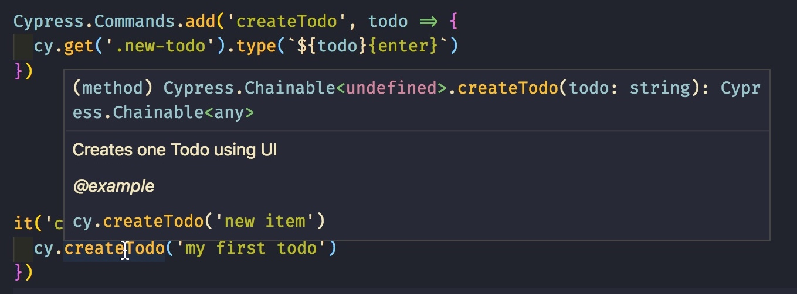

## ☀️ Custom commands

### 📚 You will learn

- adding new commands to `cy`
- supporting retry-ability
- TypeScript definition for new command
- useful 3rd party commands

+++

- keep the app running
- open `09-custom-commands/spec.cy.ts`

---

### 💯 Code reuse and clarity

```js
// name the beforeEach functions
beforeEach(function resetData() {
  const api = Cypress.env('api');
  expect(api, 'api url').to.be.a('string');
  cy.request('POST', api + '/reset', {
    todos: []
  });
});
beforeEach(function visitSite() {
  cy.visit('/');
});
```

Note:
Before each test we need to reset the server data and visit the page. The data clean up and opening the site could be a lot more complex that our simple example. We probably want to factor out `resetData` and `visitSite` into reusable functions every spec and test can use.

---

### Todo: move them into `cypress/support/e2e.ts`

Now these `beforeEach` hooks will be loaded _before every_ test in every spec. The test runner loads the spec files like this:

```html
<script src="cypress/support/e2e.ts"></script>
<script src="cypress/e2e/09-custom-commands/spec.cy.ts"></script>
```

🙋 Is this a good solution?

+++

## Reusable functions

⌨️ Todo: export the `resetData` and `visitSite` from `utils.ts`

```js
// 09-custom-commands.ts
export function resetData () { ... }
export function visitSite () { ... }
```

+++

⌨️ and update the `spec.cy.ts`

```js
import { resetData, visitSite } from './utils';
beforeEach(resetData);
beforeEach(visitSite);

// or call them from the beforeEach hook
beforeEach(() => {
  resetData();
  visitSite();
});
```

---

## My opinion 🤦🏻

> Little reusable functions are the best

```js
import {
  enterTodo,
  getTodoApp,
  getTodoItems,
  resetDatabase,
  visit
} from '../../support/utils';
it('loads the app', () => {
  resetDatabase();
  visit();
  getTodoApp().should('be.visible');
  enterTodo('first item');
  enterTodo('second item');
  getTodoItems().should('have.length', 2);
});
```

⌨️ Todo: write the function `getTodoItems`

Note:
Some functions can return `cy` instance, some don't, whatever is convenient. I also find small functions that return complex selectors very useful to keep selectors from duplication.

+++

Pro: functions are easy to document with JSDoc



+++

And then IntelliSense works immediately



+++

And MS IntelliSense can understand types from JSDoc and check those!

[https://github.com/Microsoft/TypeScript/wiki/JSDoc-support-in-JavaScript](https://github.com/Microsoft/TypeScript/wiki/JSDoc-support-in-JavaScript)

More details in: [https://slides.com/bahmutov/ts-without-ts](https://slides.com/bahmutov/ts-without-ts)

---

## Use cases for custom commands

- share code in entire project without individual imports
- complex logic with custom logging into Command Log
  - login sequence
  - many application actions

📝 [on.cypress.io/custom-commands](https://on.cypress.io/custom-commands) and Read [https://glebbahmutov.com/blog/writing-custom-cypress-command/](https://glebbahmutov.com/blog/writing-custom-cypress-command/)

+++

Let's write a custom command to create a todo

```js
// instead of this
cy.get('.new-todo').type('todo 0{enter}');
// use a custom command "createTodo"
cy.createTodo('todo 0');
```

+++

## Todo: write and use "createTodo"

```js
Cypress.Commands.add('createTodo', todo => {
  cy.get('.new-todo').type(`${todo}{enter}`);
});
it('creates a todo', () => {
  cy.createTodo('my first todo');
});
```

+++

## ⬆️ Make it better

- have IntelliSense working for `createTodo`
- have nicer Command Log:

1. Hide the individual commands inside
2. Add DOM snapshots

See the next slides 📺

+++

## Hide the commands inside

```js
Cypress.Commands.add('createTodo', todo => {
  cy.get('.new-todo', { log: false }).type(
    `${todo}{enter}`,
    { log: false }
  );
  cy.log('createTodo', todo);
});
```

+++

## DOM snapshots

```js
Cypress.Commands.add('createTodo', todo => {
  const cmd = Cypress.log({
    name: 'create todo',
    message: todo,
    consoleProps() {
      return {
        'Create Todo': todo
      };
    }
  });

  cy.get('.new-todo', { log: false })
    .type(`${todo}{enter}`, { log: false })
    .then($el => {
      cmd.set({ $el }).snapshot().end();
    });
});
```

**Pro-tip:** you can have multiple command snapshots.

+++



+++

## Add the new command to the global cy type

⌨️ Todo: add `createTodo` to `cy` object

- see the command `cy.mount` in the file `cypress/support/component.ts`
- or [https://github.com/cypress-io/cypress-example-todomvc#cypress-intellisense](https://github.com/cypress-io/cypress-example-todomvc#cypress-intellisense)

+++

- add the custom command to `support/commands.ts`
- add the type to the global `cy` in `support/component.ts`

```ts
declare global {
  namespace Cypress {
    interface Chainable {
      mount: typeof mount;
      createTodo: typeof createTodo;
    }
  }
}
```

+++

If all else fails, create `index.d.ts` with custom commands added to the global `Cypress.Chainable` interface.

+++



More JSDoc examples: [https://slides.com/bahmutov/ts-without-ts](https://slides.com/bahmutov/ts-without-ts)

Note:
Editors other than VSCode might require work.

---

## 3rd party custom commands

- [cypress-real-events](https://github.com/dmtrKovalenko/cypress-real-events)
- [cypress-grep](https://github.com/bahmutov/cypress-grep)
- [cypress-recurse](https://github.com/bahmutov/cypress-recurse)
- [cypress-xpath](https://github.com/cypress-io/cypress-xpath)
- [cypress-plugin-snapshots](https://github.com/meinaart/cypress-plugin-snapshots)
- [cypress-pipe](https://github.com/NicholasBoll/cypress-pipe)
- [Cypress testing library](https://testing-library.com/docs/cypress-testing-library/intro/)

🎓 Cypress Plugins course [https://cypress.tips/courses/cypress-plugins](https://cypress.tips/courses/cypress-plugins)

---

## Advanced concepts

- parent vs child command
- overwriting a `cy` command

[on.cypress.io/custom-commands](https://on.cypress.io/custom-commands), [https://www.cypress.io/blog/2018/12/20/element-coverage/](https://www.cypress.io/blog/2018/12/20/element-coverage/)

+++

## Example: overwrite `cy.type`

```js
Cypress.Commands.overwrite(
  'type',
  (type, $el, text, options) => {
    console.log('typing "%s"', text);

    return type($el, text, options);
  }
);
```

---

## Best practices

- Making reusable function is often faster than writing a custom command
- Know Cypress API to avoid writing what's already available <!-- .element: class="fragment" -->

Read [https://glebbahmutov.com/blog/writing-custom-cypress-command/](https://glebbahmutov.com/blog/writing-custom-cypress-command/) and [https://glebbahmutov.com/blog/publishing-cypress-command/](https://glebbahmutov.com/blog/publishing-cypress-command/)

+++

## Good plugins

- https://on.cypress.io/plugins
- https://cypresstips.substack.com/p/my-favorite-cypress-plugins
- https://cypresstips.substack.com/p/my-favorite-cypress-plugins-part

🎓 Cypress Plugins course [https://cypress.tips/courses/cypress-plugins](https://cypress.tips/courses/cypress-plugins)

➡️ Pick the [next section](https://github.com/bahmutov/todomvc-angular#contents)
