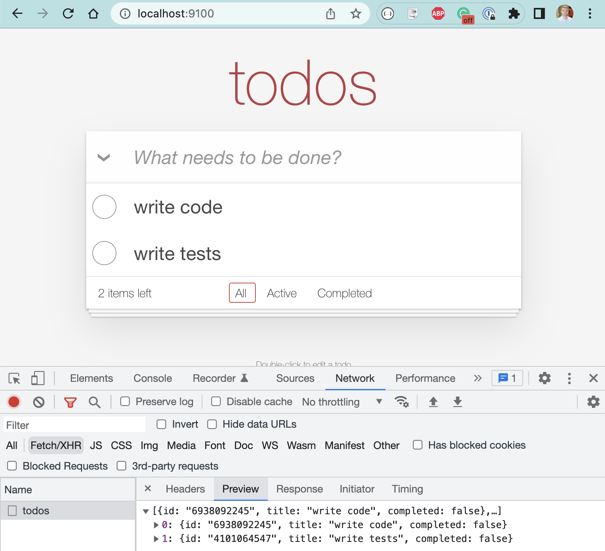

# Testing Angular Web Applications Using Cypress

- [github.com/bahmutov/todomvc-angular](https://github.com/bahmutov/todomvc-angular)

Jump to: [00-start](?p=00-start), [01-basic](?p=01-basic), [02-adding-items](?p=02-adding-items), [03-selector-playground](?p=03-selector-playground), [04-reset-state](?p=04-reset-state), [05-xhr](?p=05-xhr), [06-app-data-store](?p=06-app-data-store), [07-ci](?p=07-ci), [08-retry-ability](?p=08-retry-ability), [09-custom-commands](?p=09-custom-commands), [end](?p=end)

+++

## Author: Gleb Bahmutov, PhD

- Ex-VP of Engineering at Cypress
- Ex-Distinguished Engineer at Cypress
- actively using Cypress since 2016
- [gleb.dev](https://gleb.dev)
- [@bahmutov](https://twitter.com/bahmutov)
- [https://glebbahmutov.com/blog/tags/cypress/](https://glebbahmutov.com/blog/tags/cypress/) 200+ Cypress blog posts
- [https://www.youtube.com/glebbahmutov](https://www.youtube.com/glebbahmutov) 300+ Cypress videos
- [cypress.tips](https://cypress.tips) with links, search, my courses
- [Cypress Tips](https://cypresstips.substack.com/) monthly newsletter

---

## What we are going to cover 1/2

- example TodoMVC
  - web app, data store, REST calls
- basic page load test
- selector playground and Chrome recorder
- resetting state before the test
- any questions

+++

## What we are going to cover 2/2

- network spying and stubbing, fixtures
- component testing
- running E2E tests on CI
- retry-ability and flake-free tests

---

## Time 🕰

- total workshop duration 7-8 hours
- one hour lunch 🍲
- time for questions during the workshop and after each section

+++

<!-- Please: if you have experience with Cypress.io, help others during the workshop 🙏 -->

## Poll: have you used Cypress before?

- This is my first time
- Using for less than 1 month 👍<!-- .element: class="fragment" -->
- Using it for less than 1 year 👍👍<!-- .element: class="fragment" -->
- Using for longer than 1 year ❤️<!-- .element: class="fragment" -->
- Using for longer than 2 years ❤️❤️<!-- .element: class="fragment" -->

---

## Poll: have you used other E2E test runners?

- Selenium / Webdriver
- Protractor <!-- .element: class="fragment" -->
- TestCafe <!-- .element: class="fragment" -->
- Puppeteer / Playwright <!-- .element: class="fragment" -->
- Something else? <!-- .element: class="fragment" -->

---

## How efficient learning works

1. I explain and show
2. We do together
3. You do and I help

**Tip:** this repository has everything to work through the test exercises.

[bahmutov/todomvc-angular](https://github.com/bahmutov/todomvc-angular)

+++

🎉 If you can make all "cypress/e2e/.../\*.cy.ts" tests work, you know Cypress.

Tip: there are lots of tests to fill with code <!-- .element: class="fragment" -->

---

## Requirements

You will need:

- `git` to clone this repo
- Node v14+ to install dependencies

```text
git clone <repo url>
cd todomvc-angular
npm install
```

---

## Repo organization

- includes a web application we are going to test (port 9100)
- includes a REST API (port 3000)
- all tests are in `cypress/integration` folder
  - there are subfolders for exercises
    - `01-basic`
    - `02-adding-items`
    - `03-selector-playground`
    - `04-reset-state`
    - etc
- keep application `todomvc` running!

Note:
We are going to keep the app running, while switching from spec to spec for each part.

+++

## `todomvc`

Let us look at the application.

- `npm install`
- `npm run start:all`
- `open localhost:9100`

**important** keep application running through the entire workshop!

+++

It is a regular TodoMVC application.


+++

Look at XHR when using the app



+++

Look at `app.component.html` - the main app DOM structure

```html
<div id="app" [ngClass]="{ loaded }">
  <section class="todoapp">
    <app-header></app-header>
    <app-list *ngIf="(todos$ | async).length"></app-list>
    <app-footer
      *ngIf="(todos$ | async).length"
    ></app-footer>
  </section>
  <app-copy-right></app-copy-right>
</div>
```

+++

## Questions

- what happens when you add a new Todo item? <!-- .element: class="fragment" -->
- how does it get to the server? <!-- .element: class="fragment" -->
- where does the server save it? <!-- .element: class="fragment" -->
- what happens on start up? <!-- .element: class="fragment" -->

Note:
The students should open DevTools and look at XHR requests that go between the web application and the server. Also the students should find `data.json` file with saved items.

---

**Let's test it!**

➡️ Pick the [next section](https://github.com/bahmutov/todomvc-angular#contents)
